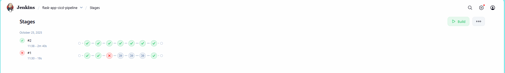
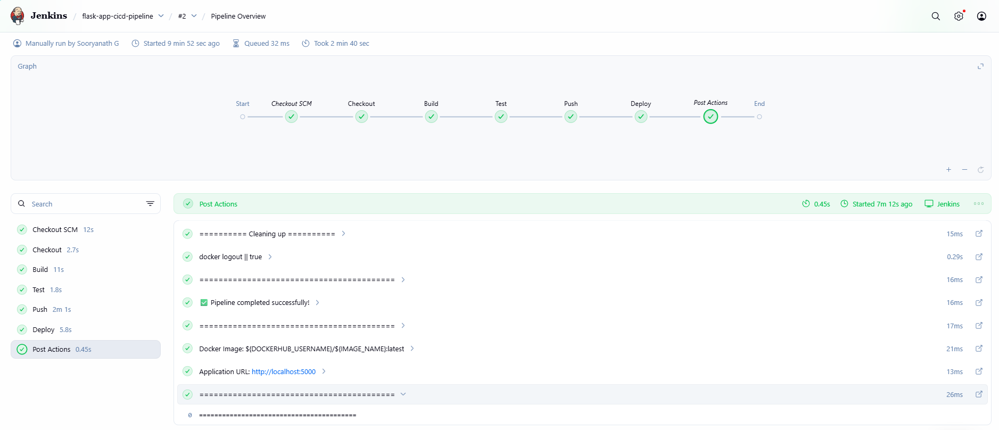
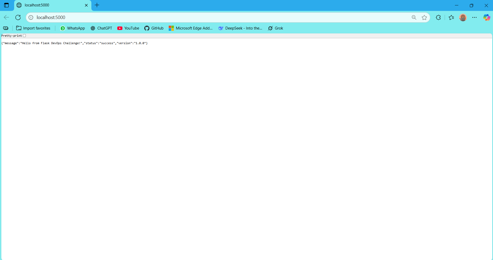

# CI/CD Pipeline Challenge - Submission

**Name:** Sooryanath G  
**GitHub Username:** sooryanathg

---

## 📦 DockerHub Image

**Image Link:** https://hub.docker.com/r/sooryanath/flask-app

**Pull Command:**
```bash
docker pull sooryanath/flask-app:latest
```

---

## 🔄 Pipeline Stages Completed

✅ **Stage 1: Checkout** - Source code checked out from GitHub  
✅ **Stage 2: Build** - Docker image built successfully  
✅ **Stage 3: Test** - Pytest tests passed  
✅ **Stage 4: Push** - Image pushed to DockerHub  
✅ **Stage 5: Deploy** - Container deployed locally on port 5000

---

## 📸 Screenshots

### 1. Jenkins Pipeline Success


### 2. All Pipeline Stages


### 3. DockerHub Repository


### 4. Application Running


---

## 🚀 How to Run

```bash
# Pull the image
docker pull sooryanath/flask-app:latest

# Run the container
docker run -d -p 5000:5000 --name flask-app sooryanath/flask-app:latest

# Access the application
curl http://localhost:5000
# Or open in browser: http://localhost:5000
```

---

## 📝 Technical Details

- **CI/CD Tool:** Jenkins
- **Container Platform:** Docker
- **Application:** Flask (Python 3.11)
- **Testing Framework:** Pytest
- **Deployment:** Local Docker container
- **Port:** 5000
- **DockerHub Repository:** sooryanath/flask-app

---

## 🔧 Jenkins Pipeline Configuration

- **Pipeline Type:** Declarative Pipeline
- **SCM:** Git (GitHub)
- **Branch:** main
- **Jenkinsfile Location:** Root directory
- **Credentials:** DockerHub (username/password)

---

## ✅ Deliverables Checklist

- [x] Jenkinsfile created with all required stages
- [x] Docker image built successfully
- [x] Tests passed using pytest
- [x] Image pushed to DockerHub
- [x] Container deployed locally
- [x] All screenshots captured
- [x] README documentation complete

---

## 🎯 Pipeline Execution Summary

**Total Builds:** Multiple successful builds  
**Final Status:** ✅ SUCCESS  
**Build Duration:** ~3-5 minutes  
**All Tests:** PASSED  

The CI/CD pipeline successfully automates the entire workflow from code checkout to deployment, demonstrating modern DevOps practices.
